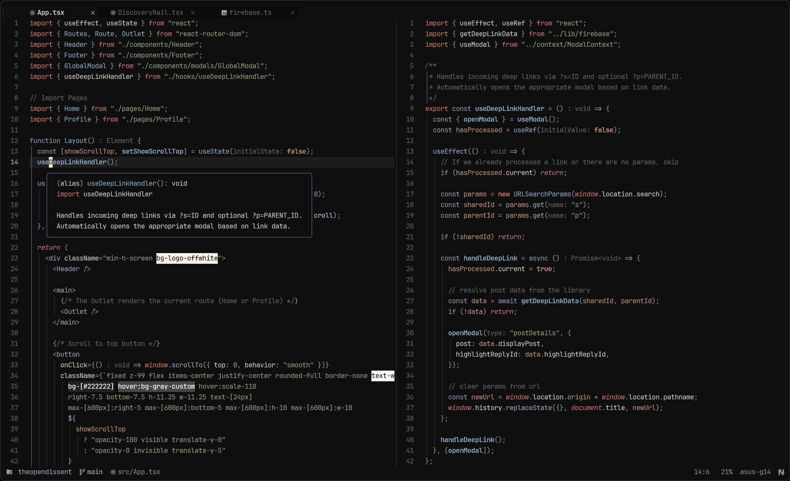

My Neovim configuration based on the [LazyVim](https://www.lazyvim.org)
distribution, with custom features to extend or remove functionality.

Comes in two varieties:

- `lite` (default)
- `full` (fully featured, enables support for more languages)

> Set the environment variable `NVIM_FULL_CONFIG=1` to switch to the full config.

## Cool Things

- macro, my custom (borrowed/extended) [color scheme](./colors/macro.lua)
- zoxide integration in [snacks.picker](./lua/plugins/picker.lua)
- sensible [markdown functionality](./lua/plugins/markdown.lua)
- these [keymaps](./lua/config/keymaps.lua)
  - `<C-S-C>`: show word/char count
  - `<S-CR>`: follow link in new tab
  - `<CR>`: follow links, `gf`, toggle checkboxes, etc
  - `B`, `E`: wrap-friendly version of `0` and `$`
  - `w`, `e`, and `b`: improved with [spider](./lua/plugins/spider.lua)
- these [auto commands](./lua/config/autocmds.lua)
  - pluginless autosave
  - trim trailing whitespace on save
  - smarter cursorline (in active window only)

## Install

```bash
brew install cargo
cargo install bob-nvim
bob install nightly
bob use nightly
```

### Dependencies

- `neovim` (>= 0.11 preferred)
- `gcc`
- `python`
- `go`
- `lazygit`
- `clang`
- `node`
- `ripgrep`/`rg`
- `fd`
- `npm` (for some language servers)
- `wslu` (if using WSL)
- `xclip` (if using WSL)

## Usage

Clone the repository and install the plugins:

```bash
# will not override current config
git clone git@github.com:n-crespo/nvim-config ~/.config/n-crespo/nvim-config
#                                              ^^^^^^^^^^^^^^^^^^^^^^^^^^^^^
#                           change this path to ~/.config/nvim to override current config
NVIM_APPNAME=n-crespo/nvim-config/ nvim --headless +"Lazy! sync" +qa
```

Open Neovim (if using custom install path):

```bash
NVIM_APPNAME=n-crespo/nvim-config/ nvim
```
