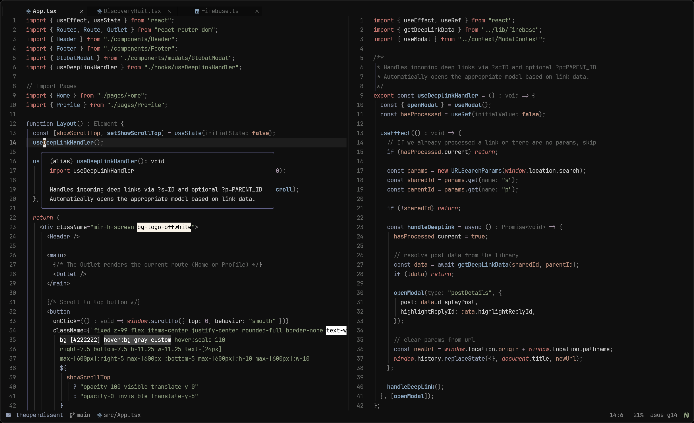

A pluginless\* Neovim configuration focusing on extending native Neovim features.

> \*: 2 plugins (mini.file and scrollEOF) that I decided were not worth
implementing myself have their source code just in a file in this repo. This is
because because a) netrw sucks and b) scrollEOF is goated.

## Cool Things

- macro, my custom (borrowed/extended) [color scheme](./colors/macro.lua)
- some [keymaps](./lua/config/keymaps.lua)
  - `<C-S-C>`: show word/char count
  - `<CR>`: to follow all kinds of links
  - `B`, `E`: wrap-friendly version of `0` and `$`
- these [auto commands](./lua/config/autocmds.lua)
  - pluginless autosave
  - trim trailing whitespace on save
  - smarter cursorline (in active window only)

## Install

If you're on ubuntu:

```bash
sudo add-apt-repository ppa:neovim-ppa/unstable
sudo apt install neovim -y
```

If you're on some other Linux:

```bash
curl-LO <tar-url-for-whatever-neovim-release-you-want>
tar -xvg <that-file>
# move that somewhere and add to your path
```

Or if you wanna install `cargo` for some reason:

```bash
cargo install bob-nvim
bob install nightly
bob use nightly
```

### Dependencies

None! Just install Neovim.

## Usage

Clone the repository and install the plugins:

Override your current config:

```bash
git clone -b min git@github.com:n-crespo/nvim ~/.config/n-crespo/nvim
nvim
```

Or don't:

```bash
git clone -b min git@github.com:n-crespo/nvim ~/.config/nvim-min
NVIM_APPNAME=nvim-min/ nvim --headless +"Lazy! sync" +qa
```

## Recommended External Tools

None!
