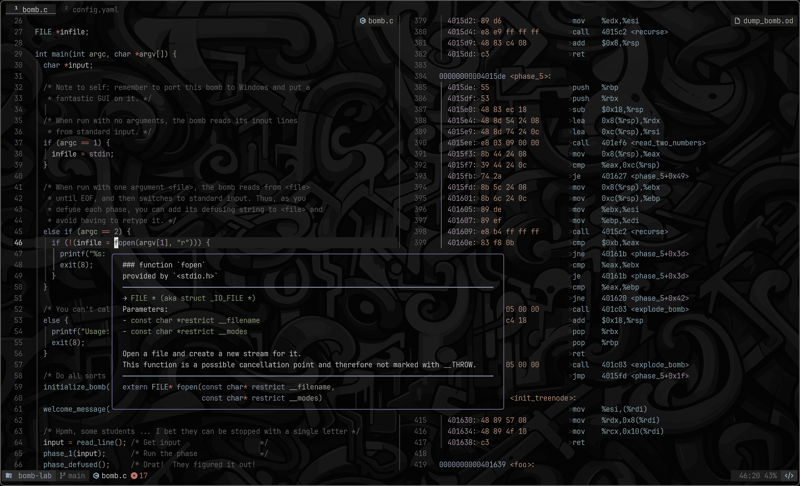

My Neovim configuration based on the [LazyVim](https://www.lazyvim.org)
distribution, with custom features to extend or remove functionality.

Comes in two varieties:

- `lite` (default)
- `full` (fully featured, enables support for more languages)

> Set the environment variable `NVIM_FULL_CONFIG=true` to switch to the full config.

## Cool Things

> [!NOTE]
> See all plugin configurations in [`lua/plugins/all.lua`](./lua/plugins/all.lua).

- zoxide integration with snacks.picker
- sensible markdown functionality
- macro, my custom (borrowed/extended) [color scheme](./colors/macro.lua)
- some [keymaps](./lua/config/keymaps.lua)
  - `<C-S-C>`: show word/char count
  - `<CR>`: to follow all kinds of links
  - `B`, `E`: wrap-friendly version of `0` and `$`
- these [auto commands](./lua/config/autocmds.lua)
  - pluginless autosave
  - trim trailing whitespace on save
  - smarter cursorline (in active window only)

## Install

```bash
cargo install bob-nvim
bob install nightly
bob use nightly
```

### Dependencies

- `neovim` (>= 0.11 preferred)
- `ripgrep`/`rg`
- `fd`
- `lazygit`
- `node`/`npm` (for some language servers)
- `wslu` (if using WSL)
- `xsel` (if using WSL)
- `clang`
- `gcc`
- `python`
- `go`

## Usage

Clone the repository and install the plugins:

```bash
# will not override current config
git clone git@github.com:n-crespo/nvim-config ~/.config/n-crespo/nvim-config
#                                              ^^^^^^^^^^^^^^^^^^^^^^^^^^^^^
#                    change this path to ~/.config/nvim to override current config
NVIM_APPNAME=n-crespo/nvim-config/ nvim --headless +"Lazy! sync" +qa
```

Open Neovim (if using custom install path):

```bash
NVIM_APPNAME=n-crespo/nvim-config/ nvim
```
